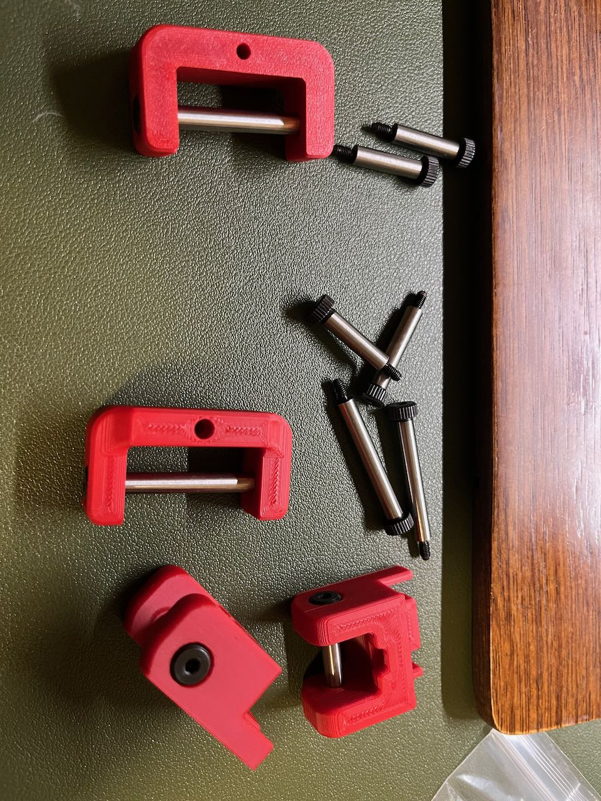
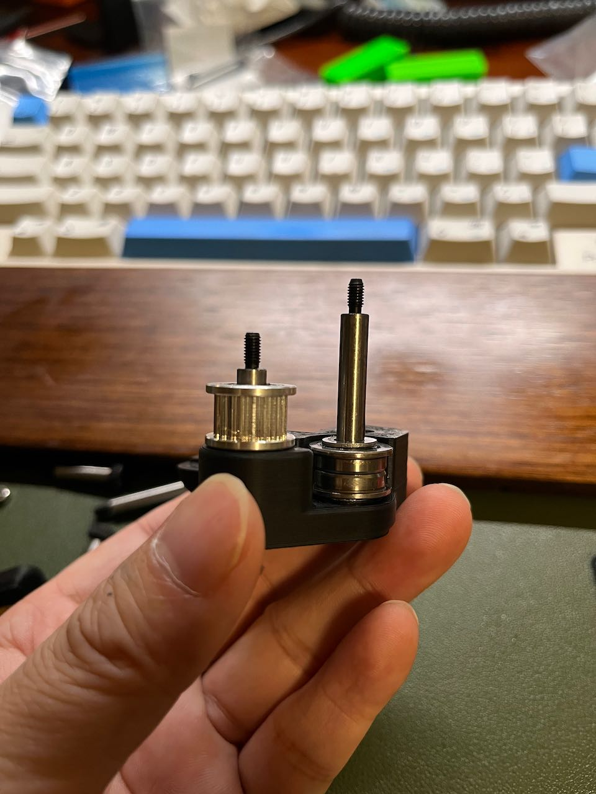
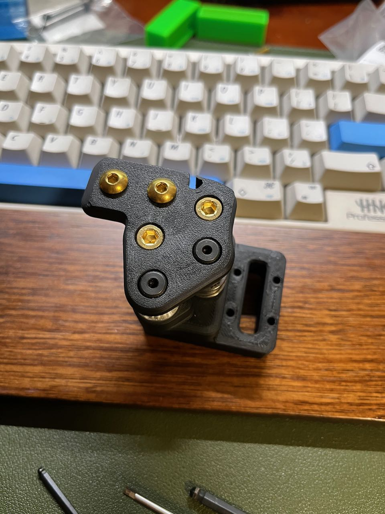

# voron 改件

* 不要吝啬你的star :)

## /2.4_shoulder_screws (Voron2.4 塞打螺丝版本)

原本的结构件里头，直接用M5的螺丝作为轴承和同步轮的轴芯，精度不是很好，特别是同步轮松松垮垮的，
经过群里@无聊 大神的提点，改成了塞打螺丝的版本，丝般润滑的效果真舒服:-)，
虽然我也不知道有多大改善～哈！

PS： STL文件夹中是需要重新打印的零件，龙门架X轴提供了9和12导轨的版本，按使用情况打印

#### BOM

* MSB5-20 * 4颗 // Z轴上部同步轮，4颗20长度
* MSB5-25 * 6颗 // 龙门架电机AB框架4颗（要M3的螺纹磨短1mm）+龙门架X轴左右同步轮2颗
* MSB5-35 * 4颗 // 龙门架X轴左右轴承2颗+龙门架Y轴顶部轴承2颗

#### 图片

